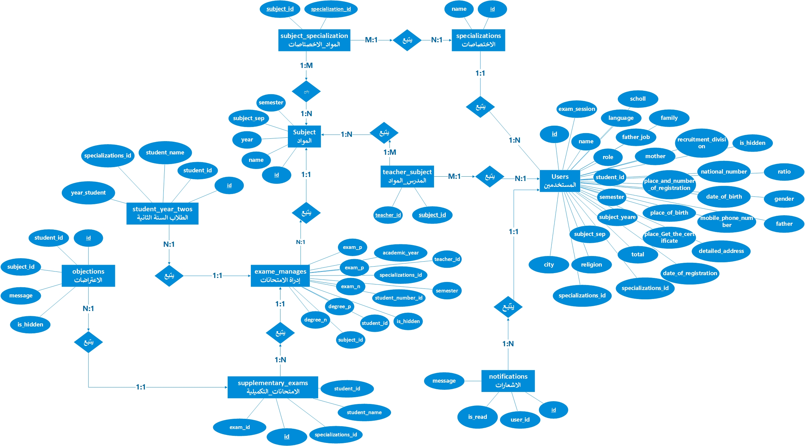
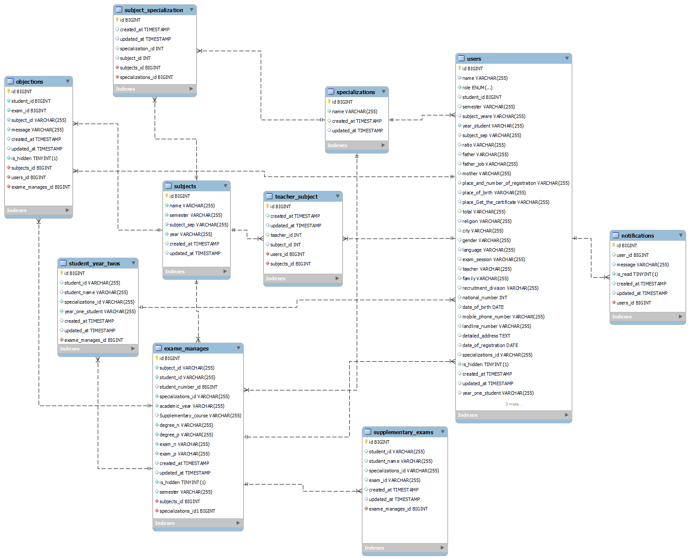

# 🎓 EduFlow ERP: Automated Institutional Management System


**EduFlow ERP** is a high-performance, fully automated **Institutional Resource Planning** system designed to streamline workflows for large-scale educational organizations. It transforms manual administrative tasks into a seamless digital ecosystem, managing everything from complex departmental hierarchies to intelligent student lifecycle transitions.

---

## 🚀 Key Features

### 🏛️ Organizational & Academic Management
* **Specialization Control:** Manage large departments like Software Engineering, Networking, and more.
* **Subject Matrix:** Intelligent course management with a distinct categorization between **Theoretical** and **Practical** modules.
* **Faculty Assignment:** Advanced module for assigning one or multiple instructors to specific subjects seamlessly.

### 🤖 The Automation Engine (Smart Logic)
The core of EduFlow ERP is its **Automated Transition Engine**. It eliminates manual grading errors through:
* **Auto-Grading Logic:** Real-time calculation of pass/fail status upon grade entry.
* **Smart Routing:** 
    * **Successful Students:** Automatically moved to advanced data display records.
    * **Unsuccessful Students:** Instantly migrated to the **Supplementary Exam System** (التكميلي) based on predefined academic rules.
* **Conflict Validation:** Built-in validation to ensure data integrity during automated migrations.

### 📊 Advanced Analytics Dashboard
A comprehensive data visualization hub for administrators providing:
* Real-time **Success/Failure** percentage charts.
* Live counters for total students, faculty members, and active courses.
* Objection tracking metrics to monitor overall organizational satisfaction.

### 📩 Interaction & Notifications
* **Student Portal:** Clean UI for students to view grades and academic status.
* **Objection System:** Students can raise appeals/objections directly from their dashboard.
* **Admin Notifications:** Real-time alerts for administrators when new objections are submitted.

---

## 🏗️ System Architecture & Database Design

To ensure a deep understanding of the system's complexity, we have documented the logic flow, database structure, and entity relationships below.

### 1. Database Relationships (ERD Highlights)
The system utilizes a highly normalized relational database structure to prevent data redundancy:
* **One-to-Many (1:N):** 
  * `Users (Students)` ➔ `Objections` & `Notifications`
  * `Specializations` ➔ `Subjects`
* **Many-to-Many (M:N):**
  * `Teachers` ⟷ `Subjects` (Managed efficiently via the `teacher_subject` pivot table).
  * `Subjects` ⟷ `Specializations` (Managed via the `subject_specialization` pivot table).
* **One-to-One (1:1):**
  * `Main Exams` ➔ `Supplementary Exams` (Ensuring strict data integrity for transitioning students).

### 2. Conceptual Logic Flow (System Logic)
This diagram illustrates the business logic, entity relationships, and the automated "Success/Fail" paths.



### 3. Physical Database Schema (Technical Structure)
The technical blueprint showing the 12+ interconnected tables, data types, and relational constraints in MySQL.



---

## 🛠️ Tech Stack

| Layer | Technology |
| :--- | :--- |
| **Backend** | Laravel (PHP 8.x) |
| **Frontend** | Blade Engine, HTML5, CSS3 |
| **Styling** | Bootstrap 5 |
| **Interactivity** | JavaScript (Vanilla & AJAX) |
| **Database** | MySQL |

---

## ⚙️ Installation & Setup

1. **Clone the repository:**
   
```bash
   git clone [https://github.com/CWD2500/EduFlow-ERP.git](https://github.com/CWD2500/EduFlow-ERP.git)
   cd EduFlow-ERP

```

2- Install Dependencies:
   - composer install
   - npm install && npm run dev
3- Environment Configuration:
   - cp .env.example .env
   - php artisan key:generate
4- Database Setup:
  - Create a database named eduflow_db.
  - Update .env with your MySQL credentials.
  - Run Migrations & Seeders:
    . php artisan migrate --seed
5- Run the Application:
  - php artisan serve

🔒 Security & Validation
   - Role-Based Access Control (RBAC): Distinct permissions securely isolating Admins, Teachers, and Students.
    
   - Data Validation: Multi-layer server-side and client-side validation to prevent SQL injection and invalid inputs.
    
   - CSRF Protection: Secure form handling strictly enforced via Laravel's built-in security features.
